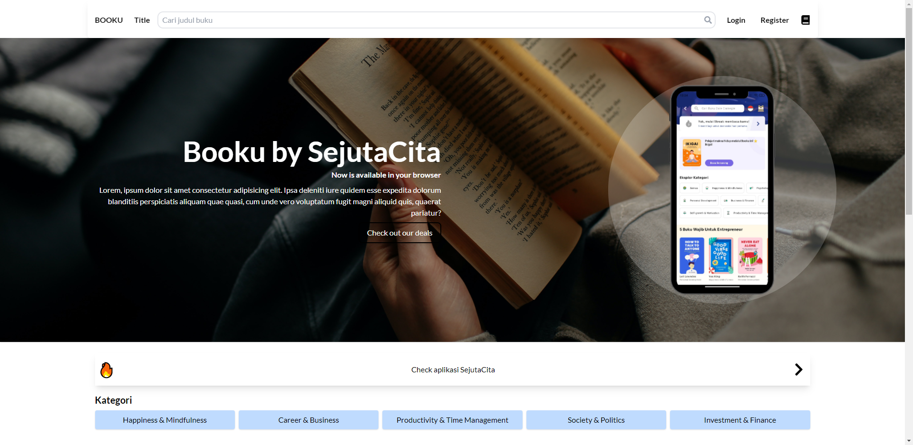
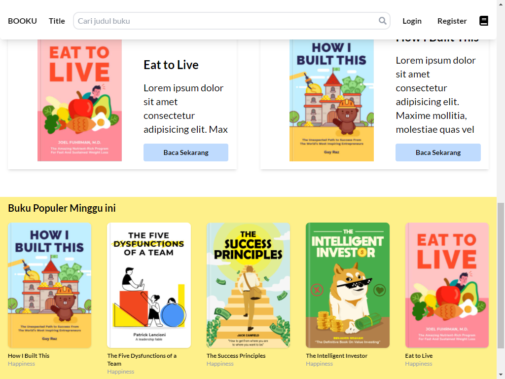
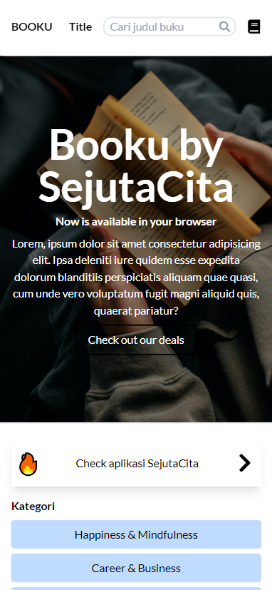
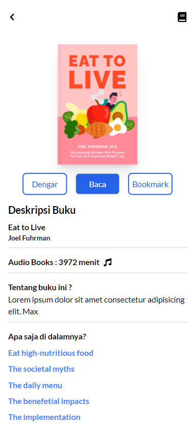
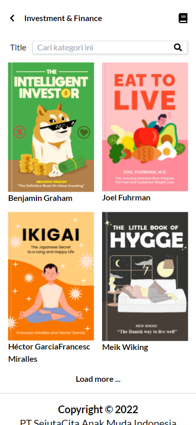

# Overview

SejutaCita take home assignement for Frontend Engineer role, it gives 2 API from categories & books and asked to made an online book store web-app. The test was assigned on Thursday 17 February 2022 and should be done before Monday 21 February 2022 23.59 PM

## How to install

Install the node_modules first

`npm install`

then start the development server

`npm start`

## Features

- Mobile first design, fully responsive up to 1920x1080 px
- Home page
- Category page
- Search bar (by title / author(need full name of the author))
- Bookmark age with CRUD to localstorage
- Pagination in category page

## Screenshoot

### Home

### Single Book Page

### Category Page

### Bookmark Page

### Built With

- React JS
- React Router
- Redux
- Tailwind CSS
- Swiper JS

### What I Learned

My very first time handling API with so many query parameters + CORS Policy. First few hours was confused because i can't access the API but with the help of Postman and Moesif CORS Extension on chrome i can access the API like any other. The method that i used to handle CORS Policy is using "proxy": 'http://the-api-here.com', in package.json file and change the fetching function URL to only the route

I just received 2 API that fetched everything within the database and have to go through all that data manipulation for fetching single data, searching title, and searching by authors thats pretty challenging. The other part is having to design the website on my own. The design was basically copied from the SejutaCita Booku android app simplified
